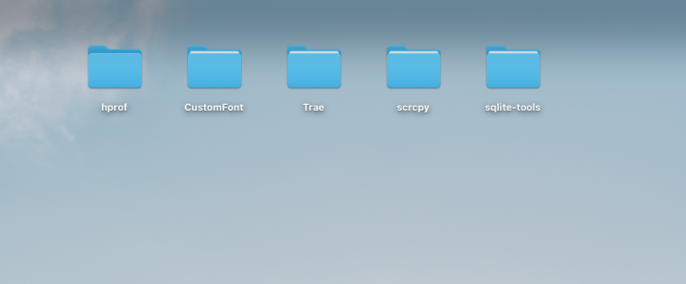
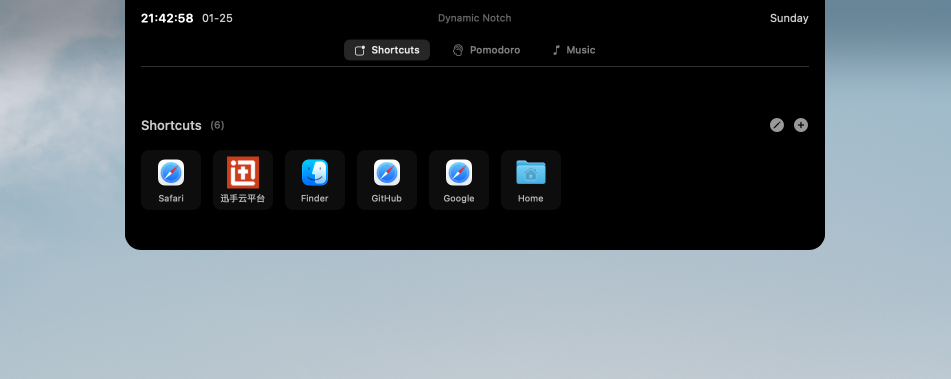
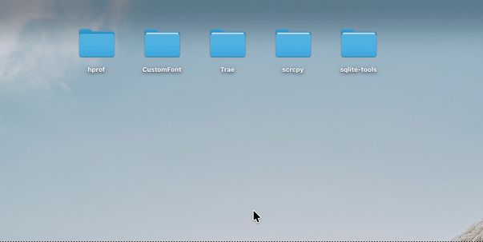
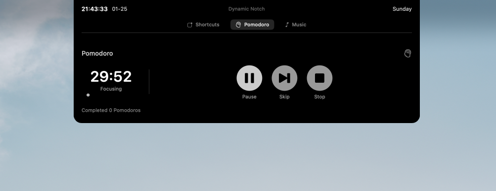
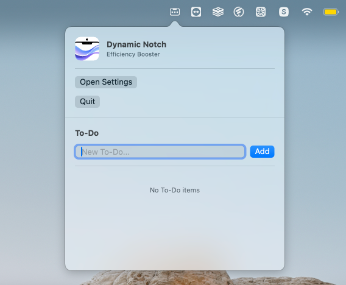
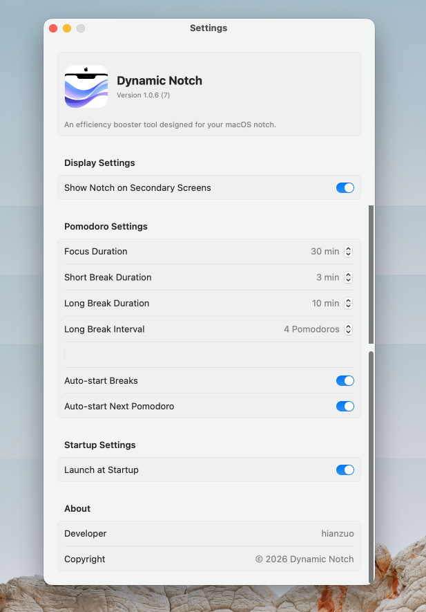

# Dynamic Notch (灵动刘海) 🎉

<div align="right">
  <a href="./README.md">English Version</a> | 中文版
</div>

<div align="center">

[](https://github.com/ryanch741/dynamic-notch/releases/latest)
[](https://github.com/ryanch741/dynamic-notch/releases)
[](LICENSE)
[](https://www.apple.com/macos/)

**✨ 专为 macOS 刘海屏设计的效率增强工具**

🖱️ 鼠标靠近自动展开 | ⏰ 时间日期 | 🚀 快捷方式 | 🍅 番茄钟 | 🎵 音乐控制 | ✅ 待办事项

</div>

## 🌟 核心特性

### 🖱️ 动态刘海交互
- **智能展开**：鼠标靠近时自动展开，平滑的缩放动画
- **智能隐藏**：不干扰日常使用，保持界面整洁

### 📦 效率模块集成

**⏰ 时间日期**
- 实时显示精确时间与星期
- 支持多语言日期格式

**🚀 快捷方式**
- 一键开启常用应用、网站和文件夹
- 支持自定义快捷方式图标
- 网站自动抓取 Favicon

**🍅 番茄钟**
- 专注力管理，25分钟工作 + 5分钟休息
- 系统级通知提醒
- 支持自定义时长和循环次数

**🎵 音乐控制**
- 实时显示 Apple Music / Spotify / 网易云音乐 / QQ音乐 播放信息
- 支持切歌、播放/暂停控制
- 精美的专辑封面展示

**✅ 待办事项**
- 便捷的 Todo 列表管理
- 集成在菜单栏，随时访问
- 本地持久化存储

### 🖥️ 多显示器支持
- 可选在副屏上显示模拟刘海条
- 完美支持多显示器工作流

### ⚡ 开机自启动
- 系统启动时自动运行
- 在设置界面可控制开关状态

### 🌍 国际化支持
- 根据系统语言自动切换中英文界面
- 完整的双语支持

## 📦 安装

### 方式一：下载 DMG 安装包（推荐）

[⬇️ 下载 灵动刘海 v1.0.7](https://github.com/ryanch741/dynamic-notch/releases/download/v1.0.7/dynamic-notch-1.0.7.dmg)

> **⚠️ 安全提示**：由于应用未经过 Apple 官方公证，首次打开可能会提示 *“Apple 无法验证是否包含恶意软件”*。
> 
> **首次打开方法：**
> 1. 在应用程序文件夹中，**右键点击**（或按住 Control 键点击）“灵动刘海.app”。
> 2. 在弹出菜单中选择 **“打开”**。
> 3. 在随后出现的对话框中点击 **“打开”** 即可。

### 方式二：Homebrew（即将支持）

```bash
```bash
# 通过 Homebrew Tap 安装
brew install --cask ryanch741/tap/dynamic-notch
```

或先添加 Tap 再安装：

```bash
brew tap ryanch741/tap
brew install --cask dynamic-notch
```
```

### 方式三：源码编译

```bash
git clone https://github.com/ryanch741/dynamic-notch.git
cd dynamic-notch
open NotchIsland.xcodeproj
# 在 Xcode 中编译运行
```

## 🖼️ 功能预览

### 动态刘海交互

<div align="center">


| 收起状态 | 展开状态 |
|:-------:|:-------:|
|  |  |
| *默认收起的刘海条状态* | *展开后显示功能模块选项* |

</div>

### 功能模块展示

<div align="center">



| 时间日期 | 快捷方式 | 番茄钟 |
|:-------:|:-------:|:------:|
|  |  |  |
| *实时显示时间和日期* | *一键启动应用和网站* | *专注计时与通知提醒* |

| 音乐控制 | 待办事项 | 设置界面 |
|:-------:|:-------:|:-------:|
|  |  |  |
| *播放信息和控制按钮* | *任务管理* | *个性化配置* |

</div>

## 💻 系统要求

- **操作系统**: macOS 14.0 (Sonoma) 或更高版本
- **推荐设备**: 带有刘海的 MacBook Pro
- **必需权限**: 
  - 辅助功能权限（用于鼠标位置监听）
  - 通知权限（用于番茄钟提醒）

## ⚙️ 配置与使用

1. 首次启动请在"系统设置 → 隐私与安全性"中允许"辅助功能"权限
2. 应用会在菜单栏显示设置入口
3. 可在设置中启用/禁用各功能模块

## 🛠️ 故障排除

### 遇到“应用损坏”或“无法验证”提示

如果打开应用时提示“应用已损坏”、“无法验证开发者”或“无法验证是否包含恶意软件”，这是 macOS Gatekeeper 的安全拦截。请尝试以下任一方法：

#### 方法 A：快捷右键打开（推荐）
1. 在访达中**右键点击**应用，选择“打开”。
2. 在弹出的对话框中点击“仍要打开”。

#### 方法 B：使用终端命令
在终端执行以下命令手动移除隔离属性：

```bash
sudo xattr -rd com.apple.quarantine /Applications/灵动刘海.app
```

然后重新启动应用。

### 无法监听鼠标位置

请确保已在"系统设置 → 隐私与安全性 → 辅助功能"中勾选"灵动刘海"。

### 番茄钟通知不显示

请确保已在"系统设置 → 通知"中允许"灵动刘海"发送通知。

## 🤝 贡献

欢迎提交 Issue 和 Pull Request 来改进这个项目！

## 📄 许可证

本项目采用 MIT 许可证 - 查看 [LICENSE](LICENSE) 文件了解详情

## 📞 支持

- **问题反馈**: [Issues](https://github.com/ryanch741/dynamic-notch/issues)
- **项目主页**: [Gitee](https://gitee.com/hianzuo/dynamic-notch)

---

<div align="center">

**感谢支持独立开发！** 🚀  
如果你觉得好用，请给我们一个 ⭐️ Star！

</div>